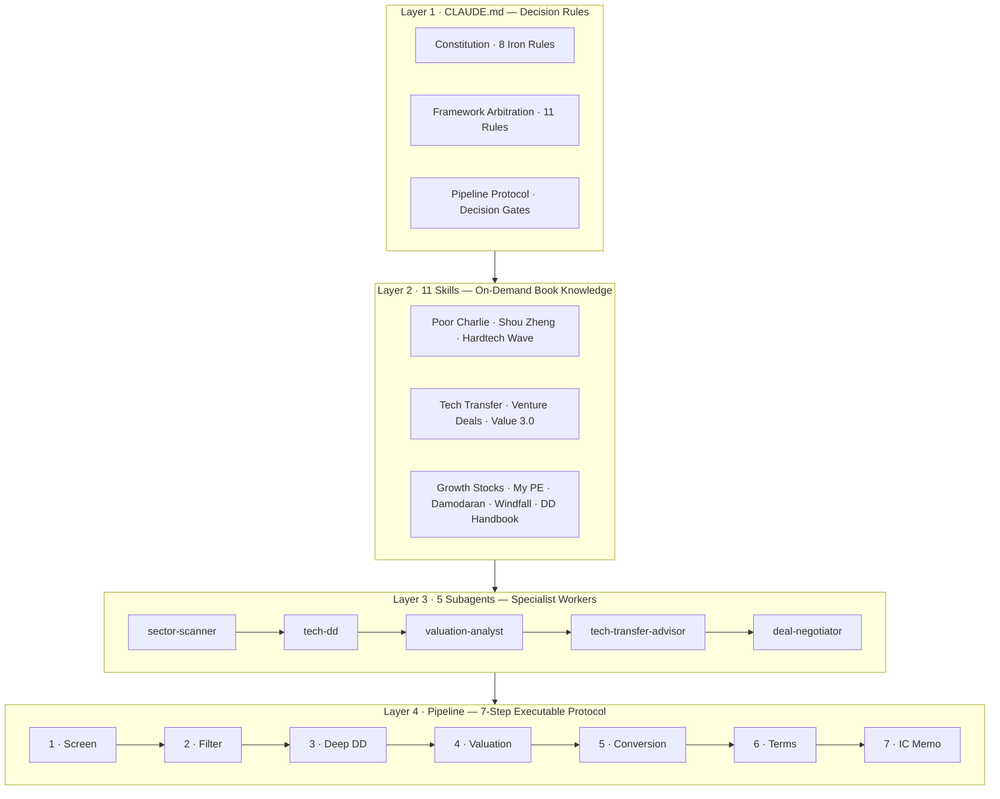
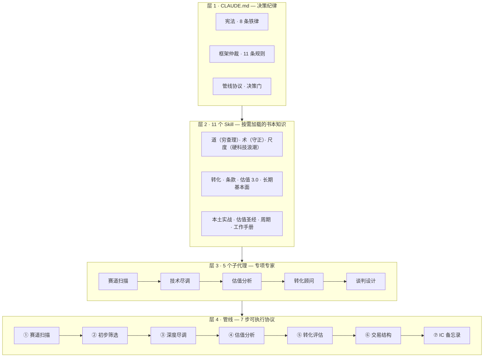

# 🎯 Hardtech Venture Capital OS

> A Claude Code-powered decision operating system for early-stage **hardtech VC** — built on an 11-book knowledge foundation, 5 specialist subagents, a 7-step executable deal pipeline, and a web-based 60-second screening dashboard. Origin: **Chengdu, China**.

<p align="center">
  
</p>

<p align="center">
  <a href="https://justinjchen-cornell.github.io/Hardtech-Venture-Capital-OS/"></a>
  
  
  
</p>

---

## 🚀 Live Demo — 60-Second Screening Dashboard

**Drop in project facts → get a structured first-pass verdict** — five frameworks fused into one client-side engine (no backend, runs entirely in your browser):

[**Open the Screening Dashboard**](https://justinjchen-cornell.github.io/Hardtech-Venture-Capital-OS/)

The dashboard encodes the system's core screening logic: three-option classification, six-item death list, three rulers (team / market / tech), ESK scoring, MatMax TRL×CRL, sign-based investing, and decision gates — output as a verdict card with risks and prioritized next actions.

---

## 🏗️ Architecture



## ✨ Highlights

- **11-book knowledge system** — from Munger's mental models to Damodaran's valuation, each distilled into an on-demand skill (verified by 3-question tests)
- **5 specialist subagents** — sector scanning (ESK + cycles), technical DD (three rulers + 9 numbers), valuation (12-step method library), tech-transfer (TRL / CRL / MatMax), deal structuring
- **Executable pipeline protocol** — every step defines input / process / output / handoff / exception branches (SOP, not prose)
- **5 decision gates** — mandatory before any investment decision (meta-facts ≥ L3, death list clean, good-ball check, Will-B-P ≥ 60, counter-arguments)
- **Framework arbitration rules** — 11 rules built on *dialectical unity of opposites* for resolving conflicts between frameworks
- **Meta-fact checklist** — evidence levels L1–L4 for facts that drive valuation (a verbal claim is not a contract)
- **Knowledge write-back protocol (RWP)** — four write-back channels so the system gets smarter with every execution
- **Scenario trigger matrix** — 10 daily scenes mapped to actions (BP 60s screen / founder 15-min prep / post-investment monitoring / quarterly audit)
- **Chengdu 4+6 focus** — anchored to the city's strategic emerging & future industries, data-driven convergence (no preset sector bias)

## 🚦 Quick Start

```bash
# 1. Load the decision rules (project-level CLAUDE.md)
cd 09.BiZZ/06.VC

# 2. Install subagents
cp agents/*.md ~/.claude/agents/

# 3. Use the system
#    "Run the 7-step pipeline on {project}" — follow 管线执行协议
#    "Open the screening dashboard" → index.html / GitHub Pages
```

## 📚 The 11-Book Foundation

| Layer | Book | Core Contribution |
|:--|:--|:--|
| Operating system | *Poor Charlie's Almanack* | Mental models · circle of competence · inversion · misjudgment psychology |
| Scale | *Hardtech Wave* | ESK framework · five technology paradigms |
| Cycle | *The Next Windfall* | New-quality transformation · timing & foam |
| Due diligence | *Shouzheng* · *My PE Views* · *Growth Tech Stocks* | Three rulers · 9-number DD · 20% rule |
| Valuation | *Value Investing 3.0* · *Investment Valuation* | BMP framework · DCF / multiples / startup |
| Conversion | *Tech Commercialization* (Tsinghua PBCSF) | TRL×CRL · MatMax · five-stage funnel |
| Terms | *Venture Deals* | E/C clauses · term sheet · negotiation |
| Handbook | *PE & DD Handbook* | 13 research elements · sign-based investing |

## 🏙️ Chengdu 4+6 Focus (candidate map, data-driven)

- **4 emerging**: new energy / new materials / low-altitude economy / aerospace
- **6 future**: quantum · bio-manufacturing · brain-computer · hydrogen & fusion · embodied AI · 6G
- No preset sector bias — the pipeline converges by project samples (≥10) × local endowment × cognitive reach

## 📁 Directory

```
CLAUDE.md · index.html (screening dashboard) · README.md
docs/rules/    framework arbitration · pipeline protocol v1.2 · RWP · scenario matrix
03.Skills/     11 skill mirrors (methodology only)
06.Concepts/   42 linked concept pages
agents/        5 subagents
scripts/       deal sourcing + book-to-skill pipeline
templates/     project card + 8 pipeline output templates
examples/      end-to-end demo (Zheng project)
docs/          design docs · constitution · book map
```

## 🗺️ Roadmap

- [x] 11-book knowledge system + 5 subagents
- [x] Executable pipeline protocol + decision gates
- [x] Meta-fact evidence levels + framework arbitration (dialectical)
- [x] Scenario trigger matrix + hybrid info collection
- [x] Screening dashboard (GitHub Pages)
- [ ] Portfolio / post-investment monitoring module
- [ ] Chengdu channel sourcing automation (enterprise-data mining)
- [ ] IC meeting workflow

## 📄 License

MIT © Justinjchen-Cornell

---

# 🇨🇳 中文版

# 🎯 Hardtech Venture Capital OS — 成都早中期硬科技投资决策操作系统

> 基于 Claude Code 的投资决策操作系统：11 本书方法论 × 5 个专项子代理 × 7 步可执行管线 × 浏览器端 60 秒初筛台。立足成都，面向早中期硬科技。

## 🚀 在线演示：项目初筛台

**把项目资料丢进去 → 60 秒出基本评判**——五个框架（穷查理 / 守正 / 硬科技浪潮 / MatMax / 迹象法）融合为纯前端引擎：

[**打开初筛台**](https://justinjchen-cornell.github.io/Hardtech-Venture-Capital-OS/)

输出：三选项分类 · 死亡清单六条 · 三把尺评分 · ESK · MatMax 定位 · 失败概率 · 决策门检查 · 下一步动作。

## 🏗️ 架构：知识三层 + 业务一条管线



## ✨ 核心特性

- **11 本书方法论**——每本蒸馏为按需加载的 skill（含 3 问验证）
- **可执行管线协议**——每步定义输入 / 处理 / 输出 / 交接 / 异常（SOP 而非散文）
- **决策门 5 道**——投决前必过（元事实≥L3 / 死亡清单无致死 / 好球对照 / Will-B-P≥60 / 反向观点）
- **框架仲裁规则 11 条**——对立统一思维解决框架冲突（如：纪律底线刚性 × 路径柔性）
- **元事实清单**——支撑估值的事实分级验证（口头 L1 ≠ 合同 L3）
- **知识回写协议（RWP）**——四类回写，让体系越用越聪明
- **场景触发矩阵**——收 BP 60 秒初筛 / 见创始人 15 分钟准备 / 投后五大监控 / 季度宪法审计
- **成都 4+6 候选地图**——不预设焦点，数据驱动收敛

## 🚦 快速开始

```bash
cd 09.BiZZ/06.VC          # 进入项目目录（自动加载决策纪律）
cp agents/*.md ~/.claude/agents/   # 安装 5 个子代理
# 打开 index.html 使用初筛台；完整项目走管线协议 7 步
```

## 📄 License

MIT © Justinjchen-Cornell
