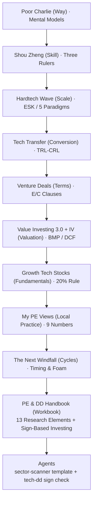
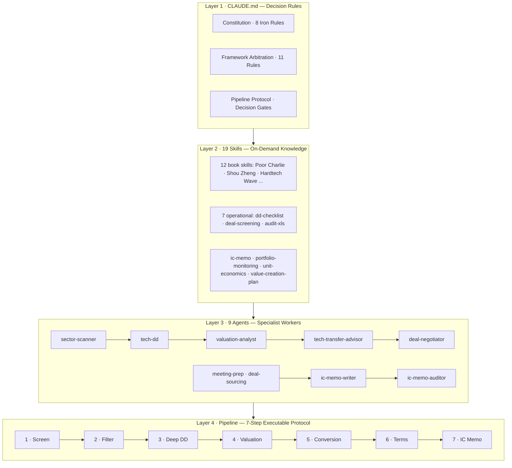

# 🎯 Hardtech Venture Capital OS

> A Claude Code-powered decision operating system for early-stage **hardtech VC** — built on an 19-skill knowledge base (11 books + 7 operational workflows), 9 specialist agents, a 7-step executable deal pipeline, 10 slash commands, and a web-based 60-second screening dashboard. Origin: **China, China**.

<p align="center">
  
</p>

<p align="center">
  <a href="https://justinjchen-cornell.github.io/Hardtech-Venture-Capital-OS/"></a>
  
  
  
  
</p>

---


## 🔗 Knowledge Chain — 11 Books → Handbook → Agents



## ⚡ One-Minute Overview

**What it is**: 11 investment classics distilled into a runnable decision toolkit — drop in project facts, get structured judgment from sector scan to post-investment.

**Start in 3 steps**:
1. 🖥️ [Open the Screening Dashboard](https://justinjchen-cornell.github.io/Hardtech-Venture-Capital-OS/) — fill 14 fields, get a 60-second verdict (zero install)
2. 📖 Read the [Deployment Guide](docs/DEPLOY.md) — 30 minutes to run your first project locally
3. 🔍 See the [Skill Status Table](docs/技能状态.md) — which books are converted and how trustworthy

**Only 5 core concepts to remember** (details in docs/rules/):
- **Three options**: every project goes to "yes / no / too hard"
- **Death list**: first ask how it dies, then why it lives
- **Meta-facts**: verbal claims ≠ written evidence (L1-L4)
- **Decision gates**: 5 mandatory gates before investing
- **Five stages**: sector/tech → team background-check → valuation/terms → decision/closing → post-investment

## 🚀 Live Demo — 60-Second Screening Dashboard

**Drop in project facts → get a structured first-pass verdict** — five frameworks fused into one client-side engine (no backend, runs entirely in your browser):

[**Open the Screening Dashboard**](https://justinjchen-cornell.github.io/Hardtech-Venture-Capital-OS/)

The dashboard encodes the system's core screening logic: three-option classification, six-item death list, three rulers (team / market / tech), ESK scoring, MatMax TRL×CRL, sign-based investing, and decision gates — output as a verdict card with risks and prioritized next actions.

---

## 🏗️ Architecture



## ✨ Highlights

- **19-skill knowledge base** — 12 book skills (Munger → Damodaran, 3-question verified) + 7 operational skills (DD checklists, memo writing, portfolio monitoring, Excel audit — workflow patterns informed by Anthropic's financial-services reference repo, adapted to China early-stage hardtech)
- **9 specialist agents** — sector scanning (ESK + cycles), technical DD (three rulers + 9 numbers + RFI tracking), valuation (method library + returns calc), tech-transfer (TRL / CRL / MatMax), deal structuring, meeting prep, deal sourcing (dedupe + founder outreach), IC memo write & audit
- **10 slash commands** — `/screen` BP 60s screen · `/meeting` founder prep · `/news` event flash · `/source` sector scan · `/roadshow` · `/review` portfolio · `/negotiate` terms · `/quarterly` audit · `/lp` report · `/ingest` info capture (scenario matrix → executable)
- **Executable pipeline protocol** — every step defines input / process / output / handoff / exception branches (SOP, not prose)
- **5 decision gates** — mandatory before any investment decision (meta-facts ≥ L3, death list clean, good-ball check, Will-B-P ≥ 60, counter-arguments)
- **Framework arbitration rules** — 11 rules built on *dialectical unity of opposites* for resolving conflicts between frameworks
- **Meta-fact checklist** — evidence levels L1–L4 for facts that drive valuation (a verbal claim is not a contract)
- **Reference integrity checker** — `scripts/check.py` validates skills/agents/wiki-links/commands before commit (0 errors 0 warnings required)
- **Knowledge write-back protocol (RWP)** — four write-back channels so the system gets smarter with every execution
- **Scenario trigger matrix** — 10 daily scenes mapped to actions (BP 60s screen / founder 15-min prep / post-investment monitoring / quarterly audit)
- **China 4+6 focus** — anchored to the city's strategic emerging & future industries, data-driven convergence (no preset sector bias)

## 🚦 Quick Start

```bash
# 1. Load the decision rules (project-level CLAUDE.md)
cd 09.BiZZ/06.VC

# 2. Install agents (9) and slash commands (10)
cp agents/*.md ~/.claude/agents/
cp .claude/commands/*.md ~/.claude/commands/

# 3. Verify integrity before committing (0 errors 0 warnings)
python scripts/check.py

# 4. Use the system
#    "Run the 7-step pipeline on {project}" — follow 管线执行协议
#    "/screen <BP>" — 60-second screening · "/source" — weekly sector scan
#    "Open the screening dashboard" → index.html / GitHub Pages
```

## 📚 The 11-Book Foundation

| Layer | Book | Core Contribution |
|:--|:--|:--|
| Operating system | *Poor Charlie's Almanack* | Mental models · circle of competence · inversion · misjudgment psychology |
| Scale | *Hardtech Wave* | ESK framework · five technology paradigms |
| Cycle | *The Next Windfall* | New-quality transformation · timing & foam |
| Due diligence | *Shouzheng* · *My PE Views* · *Growth Tech Stocks* | Three rulers · 9-number DD · 20% rule |
| Valuation | *Value Investing 3.0* · *Investment Valuation* | BMP framework · DCF / multiples / startup |
| Conversion | *Tech Commercialization* (Tsinghua PBCSF) | TRL×CRL · MatMax · five-stage funnel |
| Terms | *Venture Deals* | E/C clauses · term sheet · negotiation |
| Handbook | *PE & DD Handbook* | 13 research elements · sign-based investing |

## 🏙️ China 4+6 Focus (candidate map, data-driven)

- **4 emerging**: new energy / new materials / low-altitude economy / aerospace
- **6 future**: quantum · bio-manufacturing · brain-computer · hydrogen & fusion · embodied AI · 6G
- No preset sector bias — the pipeline converges by project samples (≥10) × local endowment × cognitive reach

## 📁 Directory

```
CLAUDE.md · index.html (screening dashboard) · README.md
.claude/commands/ 10 slash commands (scenario matrix → executable)
docs/           rules/ (arbitration · RWP · scenario matrix) · 技能状态.md · data-source mapping · skill-creation guide
skills/         19 skills (12 book + 7 operational) — single source of truth (git-tracked)
concepts/       42 linked concept pages
agents/         9 agents
pipeline/       10 output templates + 5-stage lifecycle + weekly workflow
scripts/        check.py (integrity gate) · book-to-skill · deal sourcing
templates/      project card template
docs/DEPLOY.md  deployment guide
```

## 🗺️ Roadmap

- [x] 19-skill knowledge base (11 books + 7 operational) + 9 agents
- [x] Executable pipeline protocol + decision gates
- [x] Meta-fact evidence levels + framework arbitration (dialectical)
- [x] Scenario trigger matrix + hybrid info collection
- [x] Screening dashboard (GitHub Pages)
- [x] Post-investment module (portfolio-monitoring + value-creation-plan)
- [x] IC memo workflow (ic-memo skill + writer/auditor agents)
- [x] Slash commands + reference integrity checker
- [ ] China channel sourcing automation (enterprise-data mining)
- [ ] Real-world validation on 10+ pipeline samples (4+6 convergence)

## ⚠️ Limitations (honest disclosure)

- This is a **decision-support tool**, not an automated investment bot — final judgment is yours
- It does not replace your intuition about founders (AI reads data; you read people)
- Built and validated in China's hardtech context; other markets/sectors may not apply
- **AI can be wrong** — review all outputs; critical facts require primary documents (meta-facts ≥ L3)

## 📄 License

**Apache License 2.0** — commercial use, modification, and redistribution are permitted, provided that the copyright notice and NOTICE file are retained.

© Justinjchen-Cornell · See [LICENSE](LICENSE) and [NOTICE](NOTICE) — **the NOTICE file contains copyright attribution and trademark statements; forks and derivatives must retain it**.

---

---

[🇨🇳 中文版](README.zh-CN.md)
