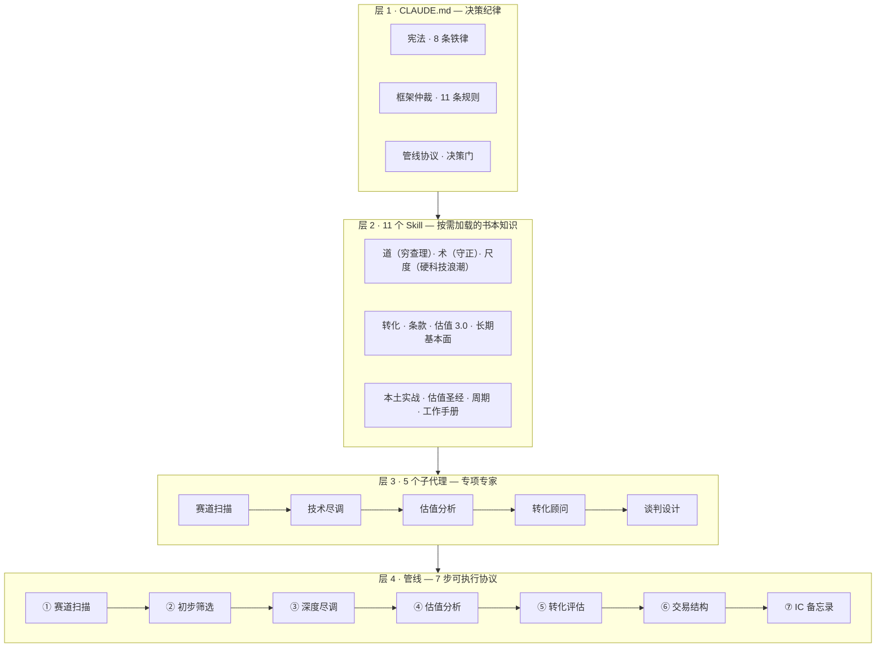

# 🎯 Hardtech Venture Capital OS — 成都早中期硬科技投资决策操作系统

> 基于 Claude Code 的投资决策操作系统：11 本书方法论 × 5 个专项子代理 × 7 步可执行管线 × 浏览器端 60 秒初筛台。立足成都，面向早中期硬科技。

## 🚀 在线演示：项目初筛台

**把项目资料丢进去 → 60 秒出基本评判**——五个框架（穷查理 / 守正 / 硬科技浪潮 / MatMax / 迹象法）融合为纯前端引擎：

[**打开初筛台**](https://justinjchen-cornell.github.io/Hardtech-Venture-Capital-OS/)

输出：三选项分类 · 死亡清单六条 · 三把尺评分 · ESK · MatMax 定位 · 失败概率 · 决策门检查 · 下一步动作。

## 🏗️ 架构：知识三层 + 业务一条管线



## ✨ 核心特性

- **11 本书方法论**——每本蒸馏为按需加载的 skill（含 3 问验证）
- **可执行管线协议**——每步定义输入 / 处理 / 输出 / 交接 / 异常（SOP 而非散文）
- **决策门 5 道**——投决前必过（元事实≥L3 / 死亡清单无致死 / 好球对照 / Will-B-P≥60 / 反向观点）
- **框架仲裁规则 11 条**——对立统一思维解决框架冲突（如：纪律底线刚性 × 路径柔性）
- **元事实清单**——支撑估值的事实分级验证（口头 L1 ≠ 合同 L3）
- **知识回写协议（RWP）**——四类回写，让体系越用越聪明
- **场景触发矩阵**——收 BP 60 秒初筛 / 见创始人 15 分钟准备 / 投后五大监控 / 季度宪法审计
- **成都 4+6 候选地图**——不预设焦点，数据驱动收敛

## 🚦 快速开始

```bash
cd 09.BiZZ/06.VC          # 进入项目目录（自动加载决策纪律）
cp agents/*.md ~/.claude/agents/   # 安装 5 个子代理
# 打开 index.html 使用初筛台；完整项目走管线协议 7 步
```

## 📄 License

MIT © Justinjchen-Cornell

---

[English README](README.md) · [中文版](README.zh-CN.md)
