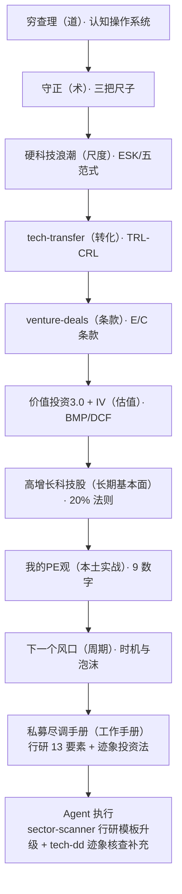
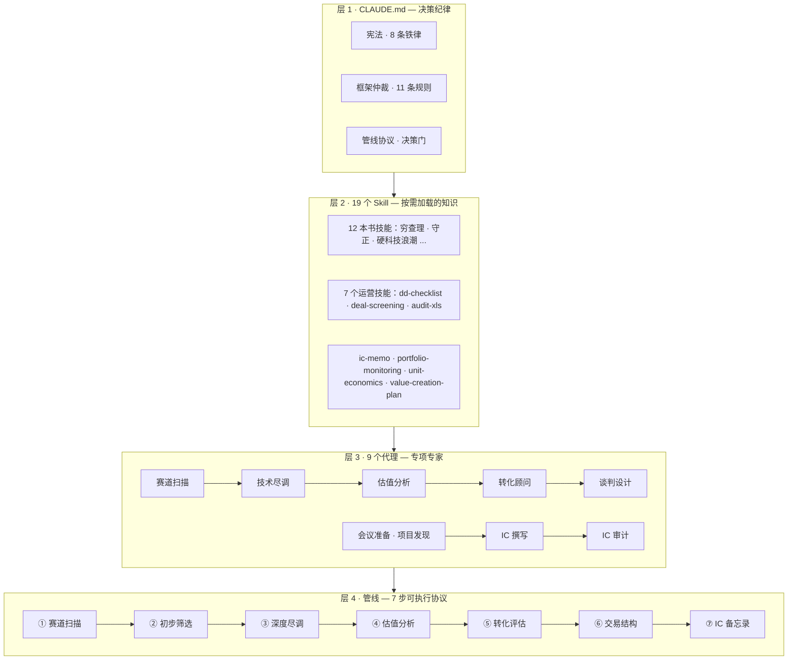

# 🎯 Hardtech Venture Capital OS — 中国早中期硬科技投资决策操作系统

> 基于 Claude Code 的投资决策操作系统：19 个技能（11 本书方法论 + 7 个运营工作流）× 9 个专项代理 × 7 步可执行管线 × 10 个斜杠命令 × 浏览器端 60 秒初筛台。立足中国，面向早中期硬科技。


## 🔗 知识链：11 本书 → 工作手册 → Agent 执行



## ⚡ 一分钟看懂

**这个系统是干嘛的**：把 11 本投资经典变成一套"能跑起来"的决策工具——丢进项目资料，帮你从扫赛道到投后管理全流程判断。

**三步开始**：
1. 🖥️ [打开初筛台](https://justinjchen-cornell.github.io/Hardtech-Venture-Capital-OS/)——填 14 个字段，60 秒出基本评判（零安装）
2. 📖 看 [部署指南](docs/DEPLOY.md)——30 分钟本地跑通第一个项目
3. 🔍 翻 [技能状态表](docs/技能状态.md)——11 本书哪些已转好、可信度如何

**只需记住 5 个核心概念**（其余详见 docs/rules/）：
- **三选项**：每个项目先归入"可以 / 不行 / 太难"
- **死亡清单**：先问"这项目会怎么死"，再谈凭什么活
- **元事实**：口头说的 ≠ 白纸黑字（证据等级 L1-L4）
- **决策门**：投决前 5 道必过的关卡
- **五阶段**：赛道验证 → 团队背调 → 估值谈判 → 投决执行 → 投后

## 🚀 在线演示：项目初筛台

**把项目资料丢进去 → 60 秒出基本评判**——五个框架（穷查理 / 守正 / 硬科技浪潮 / MatMax / 迹象法）融合为纯前端引擎：

[**打开初筛台**](https://justinjchen-cornell.github.io/Hardtech-Venture-Capital-OS/)

输出：三选项分类 · 死亡清单六条 · 三把尺评分 · ESK · MatMax 定位 · 失败概率 · 决策门检查 · 下一步动作。

## 🏗️ 架构：知识三层 + 业务一条管线



## ✨ 核心特性

- **19 个技能知识库**——12 本书技能（含 3 问验证）+ 7 个运营技能（尽调清单/备忘录/投后监控/表格审计——流程模式借鉴 Anthropic financial-services 参考仓库，适配中国早中期硬科技）
- **9 个专项代理**——赛道扫描 / 技术尽调（三把尺+9 数字+RFI 跟踪）/ 估值分析（方法库+回报测算）/ 转化顾问 / 谈判设计 / 会议准备 / 项目发现（查重+冷邮件）/ IC 撰写 / IC 审计
- **10 个斜杠命令**——`/screen` 收BP初筛 · `/meeting` 会前准备 · `/news` 事件快评 · `/source` 赛道扫描 · `/roadshow` · `/review` 投后回访 · `/negotiate` 谈判准备 · `/quarterly` 季度复盘 · `/lp` LP简报 · `/ingest` 信息入库（场景矩阵 → 可执行）
- **可执行管线协议**——每步定义输入 / 处理 / 输出 / 交接 / 异常（SOP 而非散文）
- **决策门 5 道**——投决前必过（元事实≥L3 / 死亡清单无致死 / 好球对照 / Will-B-P≥60 / 反向观点）
- **框架仲裁规则 11 条**——对立统一思维解决框架冲突（如：纪律底线刚性 × 路径柔性）
- **元事实清单**——支撑估值的事实分级验证（口头 L1 ≠ 合同 L3）
- **引用完整性校验**——`scripts/check.py` 提交前校验 skills/agents/双链/命令（0 错误 0 警告）
- **知识回写协议（RWP）**——四类回写，让体系越用越聪明
- **投资生命周期五阶段**——按投资人工作节奏组织：赛道技术转化（含技术与市场印证）→ 团队与 Key Person 背调 → 估值条款谈判 → 投决执行 → 投后管理；每阶段有专项报告、标准动作、出口标准
- **技术与市场印证专项报告**——技术优势必须变成客户愿意付的钱（防"技术自嗨"）
- **团队与 Key Person 背调专项**——背调九动作 + 独立阶段（团队是核心中的核心）
- **场景触发矩阵**——收 BP 60 秒初筛 / 见创始人 15 分钟准备 / 投后五大监控 / 季度宪法审计
- **中国 4+6 候选地图**——不预设焦点，数据驱动收敛

## 🚦 快速开始

```bash
cd 09.BiZZ/06.VC          # 进入项目目录（自动加载决策纪律）
cp agents/*.md ~/.claude/agents/            # 安装 9 个代理
cp .claude/commands/*.md ~/.claude/commands/ # 安装 10 个斜杠命令
python scripts/check.py                      # 提交前校验（0 错误 0 警告）
# 打开 index.html 使用初筛台；完整项目走管线协议 7 步；日常用 /screen /source 等命令
```

## ⚠️ 局限性（诚实声明）

- 本系统是**辅助决策工具**，不是自动投资机器人——最终判断由你负责
- 不能替代你对创始人的直觉判断（AI 看数据，你看人）
- 在中国硬科技场景构建验证，其他市场/赛道可能不适用
- **AI 可能出错**——所有输出需人工复核；关键事实以一手文件为准（元事实 ≥L3）

## 📄 License

本项目采用 **Apache 2.0 许可证**——商业使用、修改、分发均被允许，但需保留版权声明与 NOTICE 文件。

© Justinjchen-Cornell · 详见 [LICENSE](LICENSE) 与 [NOTICE](NOTICE)——**NOTICE 文件包含版权归属与商标声明**，分叉/衍生项目须保留。

---

[English README](README.md) · [中文版](README.zh-CN.md)
